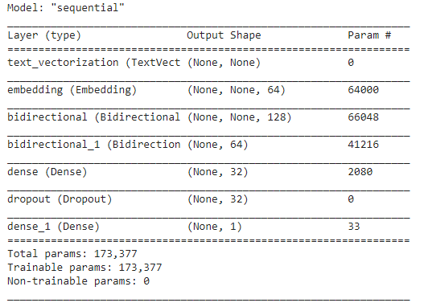
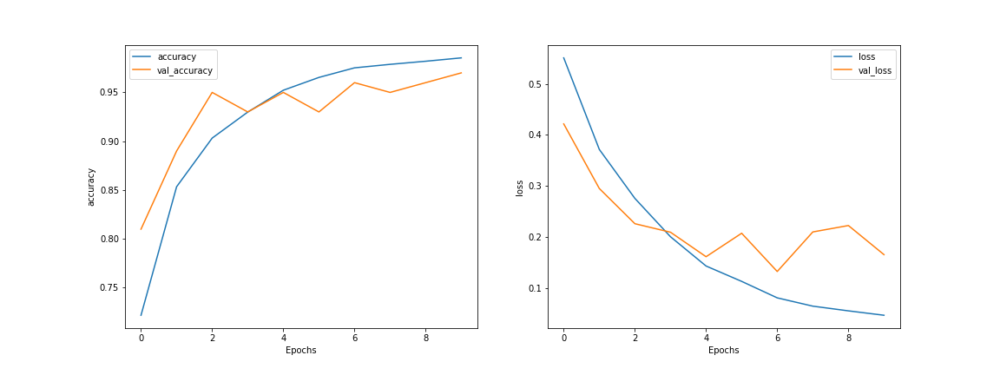

# Save Yourself
Save yourself is an app that will help you to analyze someone's tweets has a depression indication or not. This repository consists of the application API. To use this API you can deploy the API by yourself (see [installation](##installation)) or use our existing API.

## How it works
To get someone's tweet's we use Tweepy, a Twitter API library for python. Then the tweet will be preprocessed to get a clean text. After that, a Tensorflow RNN model will predict the tweet. The result is a prediction between 0 and 1. 0 means it has depression indication and, 1 has no depression indication. This model trained using data from [this](https://github.com/andrebudiman/DatasetIndikasiDepresi) repository. The data consists of 10082 tweets in Bahasa Indonesian and has been annotated with a psychologist. The model itself has an accuracy of 0.9177 in the test set.



## Installation
To run this app in your machine, make sure you have Python installed and Twitter developer account.
1. Set credentials
    
    Edit the enviroment variable file
    ```sh
    $ sudo nano /etc/environmet
    ``` 
    and add your credentials to the bottom of the file
    ```
    CONSUMER_KEY="..."
    CONSUMER_SECRET="..."
    ACCESS_TOKEN="..."
    ACCESS_TOKEN_SECRET="..."
    ```
    finally, reload the file
    ```sh
    $ source /etc/environment
    ```
1. Clone this repository
    ```sh
    $ git clone git@github.com:dickys11/save-yourself.git
    ```
1. Create a virtual environment
    
    In the `save-yourself` folder, run this command
    ```sh
    $ python -m venv venv
    ```   
    then activate the virtual environment using this command
    ```sh
    $ source venv/bin/activate
    ```
1. Install the dependencies
    
    from the `save-yourself` folder, run this command
    ```sh
    (venv) $ pip install -r app/requirements.txt 
    ```
1. Run the app
    To run the app, run this command
    ```sh
    (venv) $ uvicorn main:app --reload
    ```
1. Keep the app running
    
    If you want to keep the app running in the background, you can create a systemd service that handle this app. To do that, follow the instructions bellow:
    
    1. Create a .service file
        Use the following code to create the file
        ```sh
        $ sudo nano /etc/systemd/system/save-yourself.service
        ```
        and paste and edit the following template
        ```sh
        [Unit]
        Description=save-yourself-api
        After=network.target

        [Service]
        User=<your-username>
        WorkingDirectory=<complete this path>/save-yourself/app
        EnvironmentFile=/etc/environment
        ExecStart=<complete this path>/save-yourself/venv/bin/uvicorn main:app --host 0.0.0.0 --port 8888
        Restart=always

        [Install]
        WantedBy=multi-user.target
        ```
    1. Reload the service
        ```sh
        sudo systemctl daemon-reload
        ```
    1. Start the service
        ```sh
        sudo systemctl start save-yourself.service
        ``` 
    1. Enable the service in every reboot
        ```sh
        sudo systemctl enable your-service.service
        ```
    1. To check the status
        ```sh
        sudo systemctl status your-service.service
        ```
## Usage
If you deploy the app on your own, simply change the ip address to match yours.

### Make predictions
Return json data containing the username, and list of the tweets with it predictions

- URL

    34.87.19.67:8888/getstatus/username/num_page
- Method
    
    `GET`
- URL Params

    Required:
    
    `username=[string]` - Specifies the username of the user

    `num_page=[integer]` - Specifies the number of page that will be retrieve. One page contains 20 tweets

- Data Params
    
    None

- Success Respones:

    - Code: 200
    
        Content: 
        ```
        {
        "username": "username",
        "tweet": [
            {
            "text": "some tweet",
            "created_at": "Mon May 31 00:00:00 +0000 2021",
            "id": "1399353302828012134",
            "prediction": 0.9984841346740723
            }
        ]}
        ```

- Error Response

    - Code: 401 Unauthorized
        
        Content: `{"detail": "Unauthorized"}`
    
        OR
    - Code: 404 Not Found

        Content: `{"detail": "Not Found"}`

- Sample Call
    ```sh
    curl -X 'GET' \
    'http://34.87.19.67:8888/getstatus/cuekinajaterus/1' \
    -H 'accept: application/json'
    ```

## Configurations
This API will filter the tweets based on a keyword. The default keywords are:
```
sedih, marah, depresi, menyedihkan, kesepian, sengsara, sakit, aku, diriku, selalusedih, marah, depresi, menyedihkan, kesepian, sengsara, sakit, aku, diriku, selalu
```
if you deploy the app on your own, you can modify the keywords in `config.py` file.